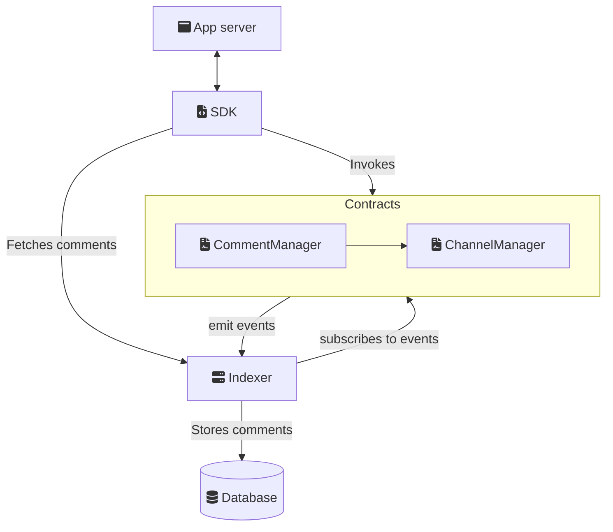

# How It Works

The Ethereum Comments Protocol enables decentralized commenting through a combination of smart contracts and an indexing infrastructure.

## Architecture Overview

### 1. Comment Manager (Smart Contract)

- Manages comment storage and threading relationships
- Emits events for comment additions, deletions, and approvals
- Implements a [dual-signature system](/dual-signature-system), allowing both authors and app signers to authorize actions

See [CommentManager](/contracts#comment-manager-contract-details) for more details.

### 2. Channel Manager (Smart Contract)

- Manages channel storage
- Handles fees for channel creation and comment posting
- Pluggable via hooks

See [ChannelManager](/contracts#channel-manager-contract-details) for more details.

### 3. Indexer

- Listens for comment events onchain
- Processes and indexes comments for efficient querying
- Maintains a synchronized database of all comments

### 4. SDK

- Provides easy-to-use interfaces for developers
- Handles interaction with smart contracts
- Manages connections to indexer services
