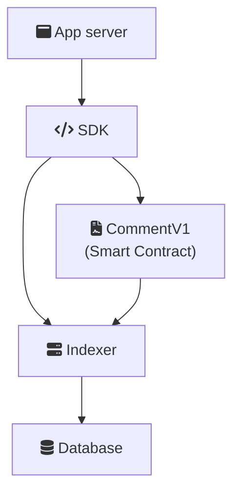

# How It Works

The Ethereum Comments Protocol enables decentralized commenting through a combination of smart contracts and an indexing infrastructure.

## Architecture Overview

### 1. CommentV1 (Smart Contract)
- Manages comment storage and threading relationships
- Emits events for comment additions, deletions and approvals
- [Dual-signature system](/dual-signature-system) where both authors and app signers can authorize actions

### 2. Indexer
- Listens for comment events on-chain
- Processes and indexes comments for efficient querying
- Maintains a synchronized database of all comments

### 3. SDK
- Provides easy-to-use interfaces for developers
- Handles interaction with smart contracts
- Manages connection to indexer services
