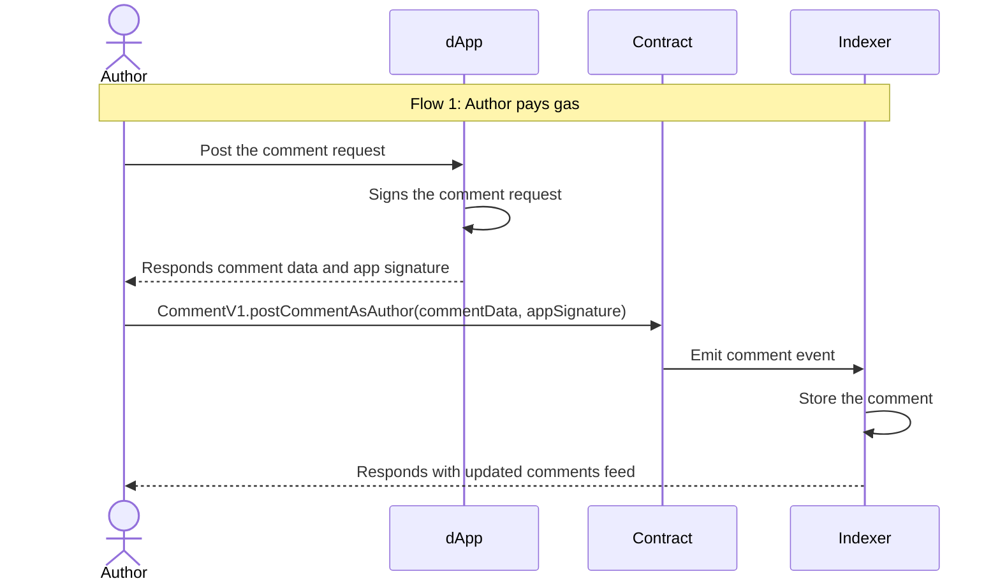
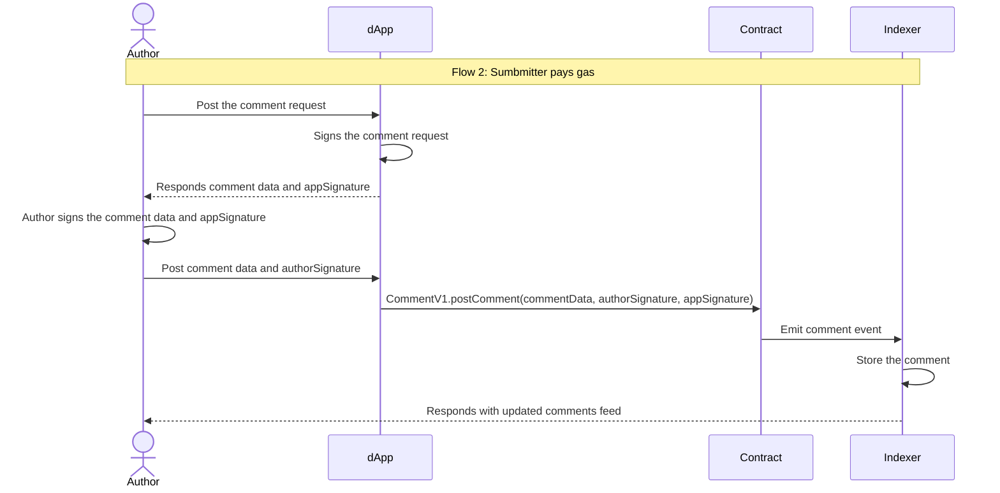
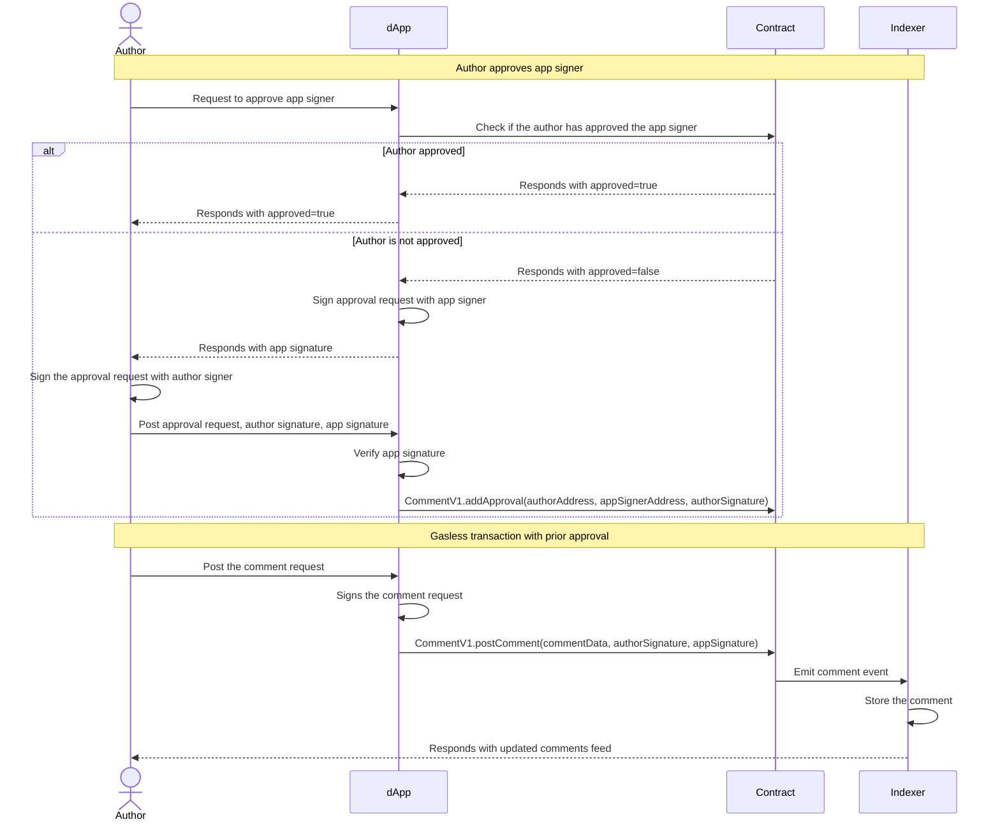

## Post comment flow

There are different approaches to post a comment, each comes with pros and cons.

### 1. Author pays gas

The simplest approach is having the author pay the gas fee directly. The flow works as follows:

1. The author creates a post comment request containing the comment details
2. The dApp signs this request using its appSigner to authorize the post action
3. The dApp returns the signature to the author
4. The author submits and pays for the transaction on-chain

This provides a direct path for posting comments, though it requires the author to have funds for gas fees.

While this approach requires authors to interact with their wallet and pay gas fees, 
which impacts user experience, it provides the strongest security guarantees. 
Comments can only be published with explicit authorization from the author's wallet, 
ensuring full control over their content and preventing unauthorized posts.

### 2. Gasless transaction (submitter pays gas)

This approach is similar to the first one, but with a key difference in who pays the gas fees. 
Instead of the author directly interacting with the contract and paying gas, 
they send their signed transaction to the dApp. 
The dApp's submitter wallet then handles submitting the transaction and pays the gas fees on behalf of the author.

This enables a smoother user experience since authors don't need to hold network tokens for gas. 
The dApp takes on the responsibility of transaction costs while still maintaining security through the author's signature.

This approach significantly improves the user experience by eliminating the need for authors to pay gas fees or maintain token balances.
The dApp handles all transaction costs, making the commenting process seamless for end users.
While this adds some implementation complexity for the dApp developer - requiring proper signature verification and gas fee management - it provides an optimal balance between security and usability. The user's signature still ensures full content ownership and authorization, while removing friction from the interaction process.

### 3. Gasless transaction with prior approval

Both approaches 1 and 2 require the author to sign each transaction, which can be cumbersome for frequent commenters.
Approach 3 streamlines this process by implementing a prior approval system - the author grants permission to the dApp once,
allowing it to post comments on their behalf going forward. This significantly reduces friction for active users while
maintaining security through the initial authorization.

