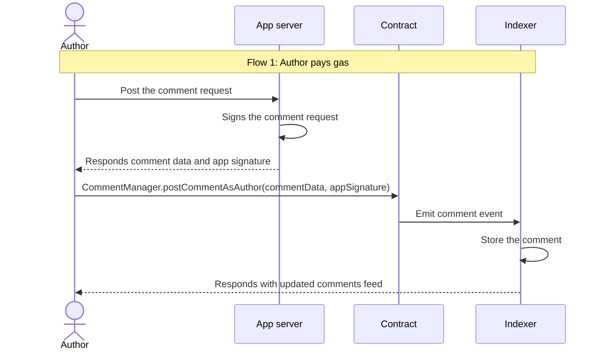
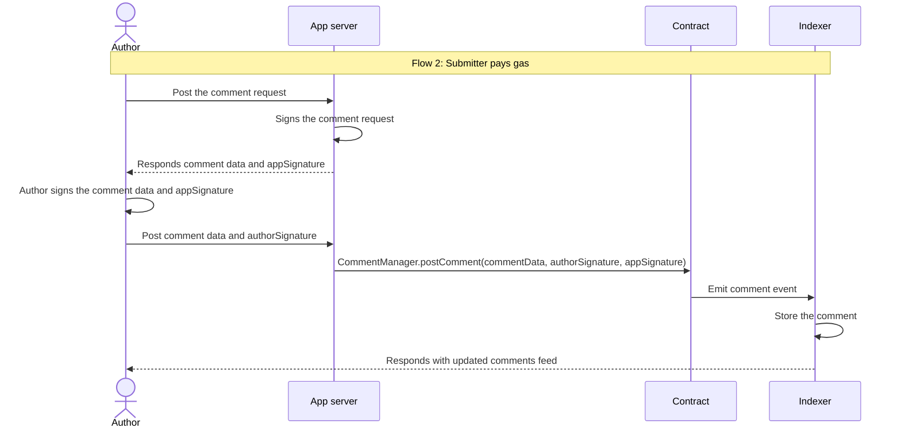
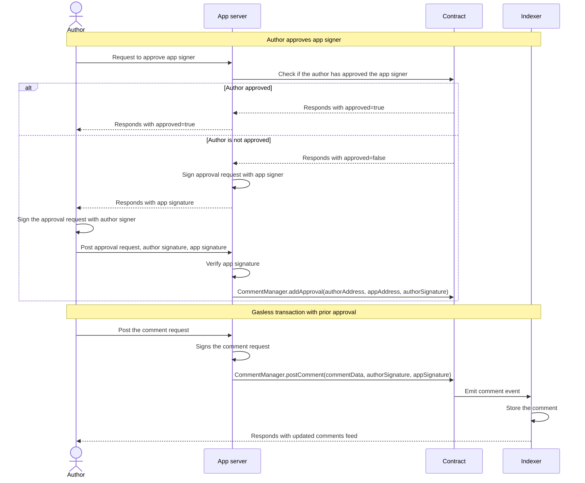

## Commenting UX Flows

There are several approaches to posting a comment, each with its own pros and cons.

In this guide, we are going through these different options for posting a comment.
It is recommended to finish the [architecture overview](/architecture-overview) and [dual signature system](/dual-signature-system) first.

### 1. Author pays gas

The simplest approach is having the author pay the gas fee directly. The process works as follows:

1. The author creates a post comment request containing the comment details
2. The app server signs this request using its `app` to authorize the post action
3. The app server returns the signature to the author

This provides a direct path for posting comments, though it requires the author to have funds for gas fees.

While this approach requires authors to interact with their wallet and pay gas fees,
which impacts user experience, it provides the strongest security guarantees.
Comments can only be published with explicit authorization from the author's wallet,
ensuring full control over their content and preventing unauthorized posts.

### 2. Gasless transaction (submitter pays gas)

This approach is similar to the first one, but with a key difference in who pays the gas fees.
Instead of the author directly interacting with the contract and paying gas,
the author sign a message authorizing a single comment to be posted on their behalf.
The app server's submitter wallet then handles submitting the transaction and pays the gas fees on behalf of the author.

This enables a smoother user experience since authors don't need to hold network tokens for gas.
The app server takes on the responsibility of transaction costs while still maintaining security through the author's signature.

This approach significantly improves the user experience by eliminating the need for authors to pay gas fees or maintain token balances.
The app server handles all transaction costs, making the commenting process seamless for end users.
While this adds some implementation complexity for the app server developer - requiring proper signature verification and gas fee management - it provides an optimal balance between security and usability. The user's signature still ensures full content ownership and authorization, while removing friction from the interaction process.

### 3. Gasless transaction with prior approval

Both approaches 1 and 2 require the author to sign each transaction, which can be cumbersome for frequent commenters.
Approach 3 streamlines this process by implementing a prior approval system - the author grants permission to the app server once,
allowing it to post comments on their behalf going forward. This significantly reduces friction for active users while
maintaining security through the initial authorization.

